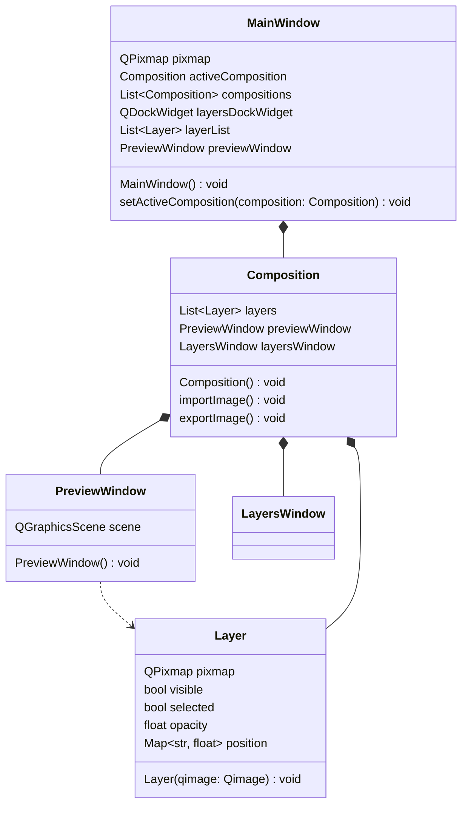

# Class diagram

```mermaid
classDiagram
    class MainWindow {
        QPixmap pixmap
        Composition activeComposition
        List~Composition~ compositions
        QDockWidget layersDockWidget
        List~Layer~ layerList
        PreviewWindow previewWindow
        MainWindow() void
        setActiveComposition(composition: Composition) void
    }
    class PreviewWindow {
        QGraphicsScene scene
        PreviewWindow() void
    }
    class Layer {
        QPixmap pixmap
        bool visible
        bool selected
        float opacity
        Map~str, float~ position
        Layer(qimage: Qimage) void
    }

    class Composition {
        List~Layer~ layers
        PreviewWindow previewWindow
        LayersWindow layersWindow
        Composition() void
        importImage() void
        exportImage() void
    }

    PreviewWindow ..> Layer
    Composition *-- Layer
    Composition *-- PreviewWindow
    Composition *-- LayersWindow
    MainWindow *-- Composition
```
