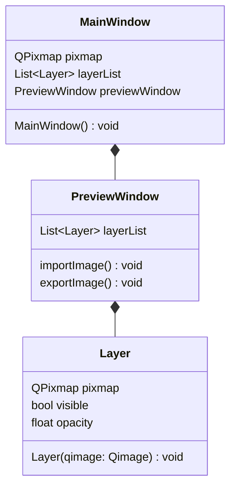

```mermaid
classDiagram
    class MainWindow {
        QPixmap pixmap
        List~Layer~ layerList
        PreviewWindow previewWindow
        MainWindow() void
    }
    class PreviewWindow {
        List~Layer~ layerList
        importImage() void
        exportImage() void
    }
    class Layer {
        QPixmap pixmap
        bool visible
        float opacity
        Layer(qimage: Qimage) void
    }

    PreviewWindow *-- Layer
    MainWindow *-- PreviewWindow
```